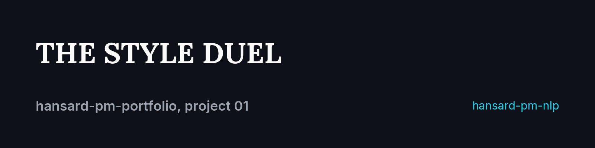
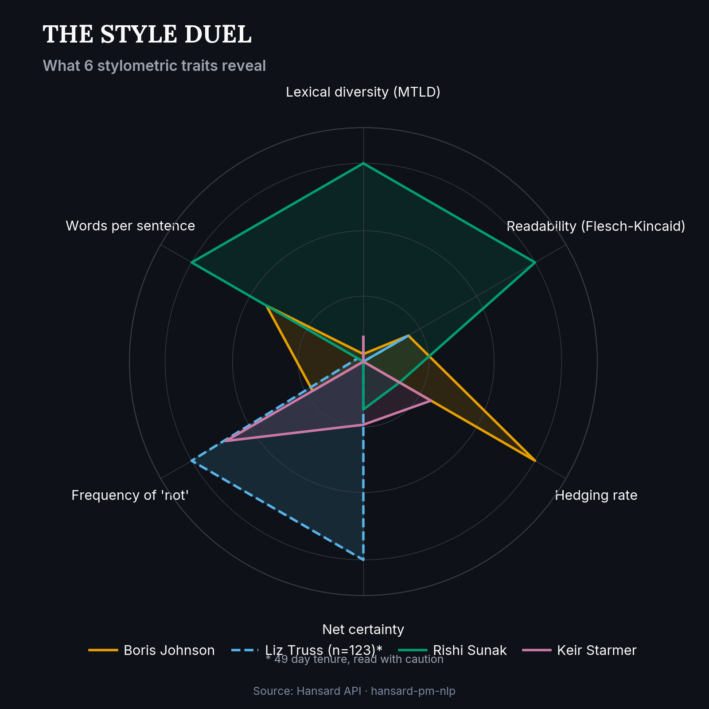
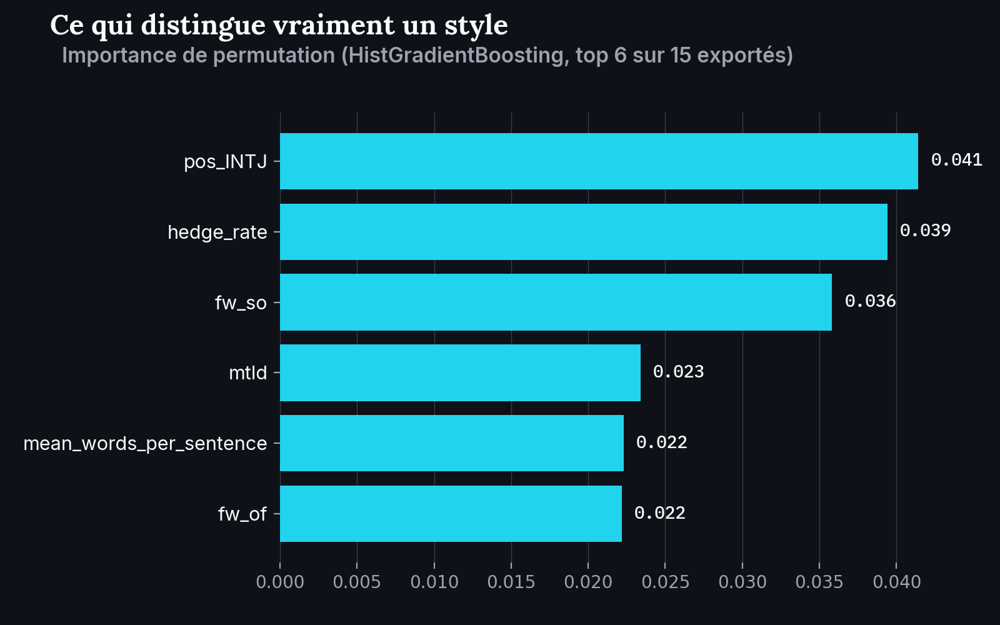
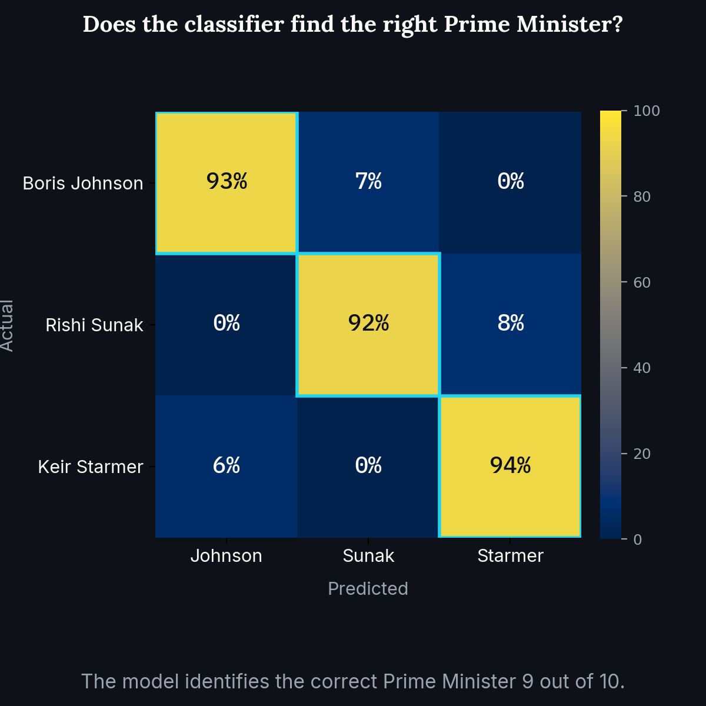

<p align="center">
  
</p>

# The style duel

[](https://www.python.org/)
[](https://hansard-pm-nlp-nhenez39aujxgtejnyjvrg.streamlit.app)
[](https://github.com/RedaAllab/hansard-pm-nlp)

**Language style alone is enough to identify who is speaking, and here are the 6 traits that prove it.**

## Contents

- [The message in 3 sentences](#the-message-in-3-sentences)
- [How this visual was built](#how-this-visual-was-built)
- [What it reveals](#what-it-reveals)
- [Secondary visuals](#secondary-visuals)
- [Limitations](#limitations)
- [Reproducing this visual](#reproducing-this-visual)
- [Links](#links)

<p align="center">
  
</p>

## The message in 3 sentences

Every UK Prime Minister has a recognizable speaking style, measured here across 6 stylometric traits: lexical diversity, readability, hedging, certainty, frequency of "not", sentence length. This is not just a visual impression: a classifier trained only on these traits (no content words at all) identifies the correct Prime Minister in 91.5 to 93.2% of cases, far above chance (33%). The radar above visualizes what the model learned to detect.

## How this visual was built

- **No new model trained**: reads artifacts `hansard-pm-nlp` already computed (Phases 3, 4, 6), no `build_*.py` script re-run.
- **6 traits, not 14**: kept readable per [`STYLE_DUEL.md`](../../STYLE_DUEL.md) §6. "Not" frequency is recomputed (Phase 6 only covers 3 of 4 PMs for it); the other 5 are unchanged whole-corpus exports.
- **`pos_INTJ` replaced with `mean_words_per_sentence`**: `pos_INTJ` needs spaCy, only run for 3 PMs. Detail: [`ARCHITECTURE.md`](../../ARCHITECTURE.md) §5.
- **Model evidence**: classifier trained on a temporal split, full report in [`phase6_classifier_report.md`](https://github.com/RedaAllab/hansard-pm-nlp/blob/main/data/processed/phase6_classifier_report.md).

## What it reveals

- Rishi Sunak stands out with markedly higher lexical diversity and readability than the other three: a more measured, less repetitive style.
- Boris Johnson dominates the "hedging" axis (`hedge_rate`) by a wide margin: a speaking style that qualifies and hedges its claims more than the others.
- Liz Truss and Keir Starmer look similar on several axes despite opposing parties, a reminder that speaking style does not necessarily track the political divide.
- The classifier statistically confirms what the radar shows visually: these style differences are stable and distinct enough to identify the author of an anonymized excerpt nine times out of ten.

## Secondary visuals

<table>
<tr>
<td width="50%"></td>
<td width="50%"></td>
</tr>
</table>

The first shows which traits matter most to the more accurate model (HistGradientBoosting): interjection rate (`pos_INTJ`) and hedging (`hedge_rate`) come out on top. The second shows, PM by PM, how rarely the model gets it wrong.

## Limitations

- **Liz Truss is outside the classifier**: 5 documents over a 49 day tenure are too few for a reliable train/test split (see `hansard-pm-nlp/src/hansard_pm_nlp/split.py`). Her line on the radar (dashed, asterisked) is an average over a very small sample (n=123 contributions), to be read with caution, not as an "established" style on the same footing as the other three.
- **Style, not content**: this visual measures *how* each PM speaks (lexical diversity, sentence length, hedging...), never *what about*. No content word ever enters the classifier. A classifier on topical content would give a different result and would not be testing the same thing.
- **4 of the radar's 6 traits are not the bar chart's 6 traits**: see the note above ("How this visual was built"). The two visuals overlap on 3 traits (`mtld`, `hedge_rate`, `mean_words_per_sentence`), not all 6.
- **Andy Burnham is out of scope**: he became Prime Minister on 2026-07-20 (see `PHASE0_SCOPING.md` in the `hansard-pm-extraction` repo), after this corpus's extraction cutoff, and is deliberately excluded from this project's scope for now.

## Reproducing this visual

From this repo's root:

```bash
jupyter nbconvert --to notebook --execute --inplace notebooks/01_style_duel.ipynb
```

Prerequisite: `hansard-pm-nlp` cloned as a sibling directory (`../hansard-pm-nlp`), see this repo's [root README](../../README.md) for details.

## Links

- [Interactive dashboard](https://hansard-pm-nlp-nhenez39aujxgtejnyjvrg.streamlit.app): the "Overview" tab reproduces this radar in a filterable form
- [`hansard-pm-nlp`](https://github.com/RedaAllab/hansard-pm-nlp): source repo for the data and model
- [`phase6_classifier_report.md`](https://github.com/RedaAllab/hansard-pm-nlp/blob/main/data/processed/phase6_classifier_report.md): full technical report of the classifier
- [`WRITEUP.md`](https://github.com/RedaAllab/hansard-pm-nlp/blob/main/WRITEUP.md): full write-up of the analysis project
- [Project 04, the recap](../04_annual_recap/README.md): this radar's traits condensed into one tone marker per year, alongside the other 3 projects
