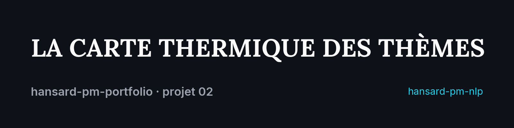
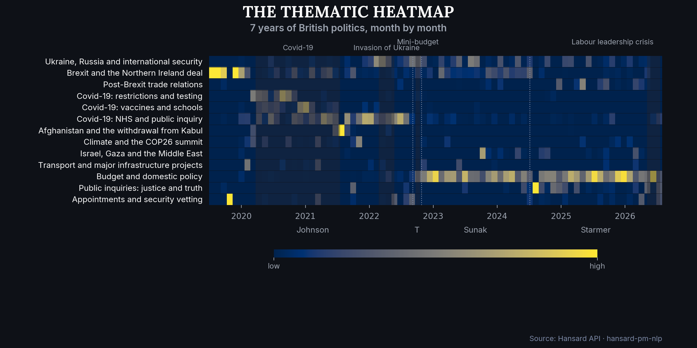
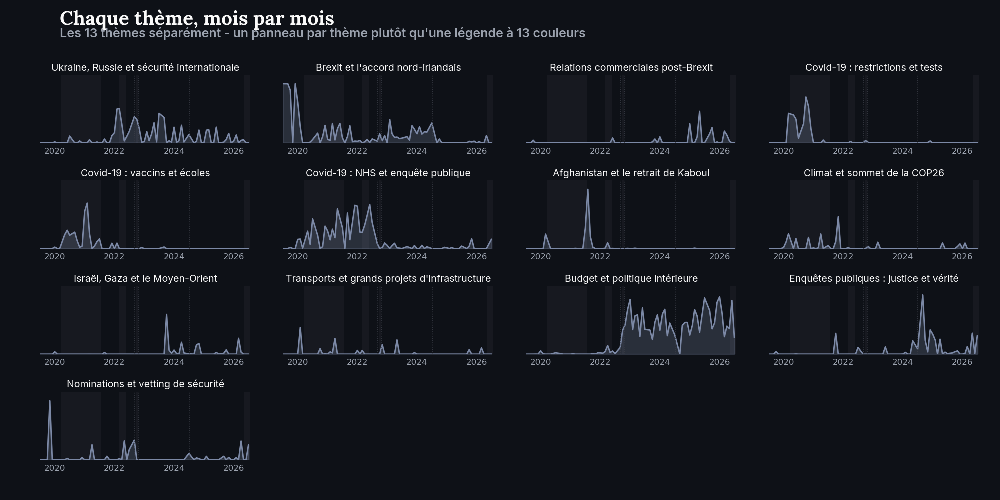
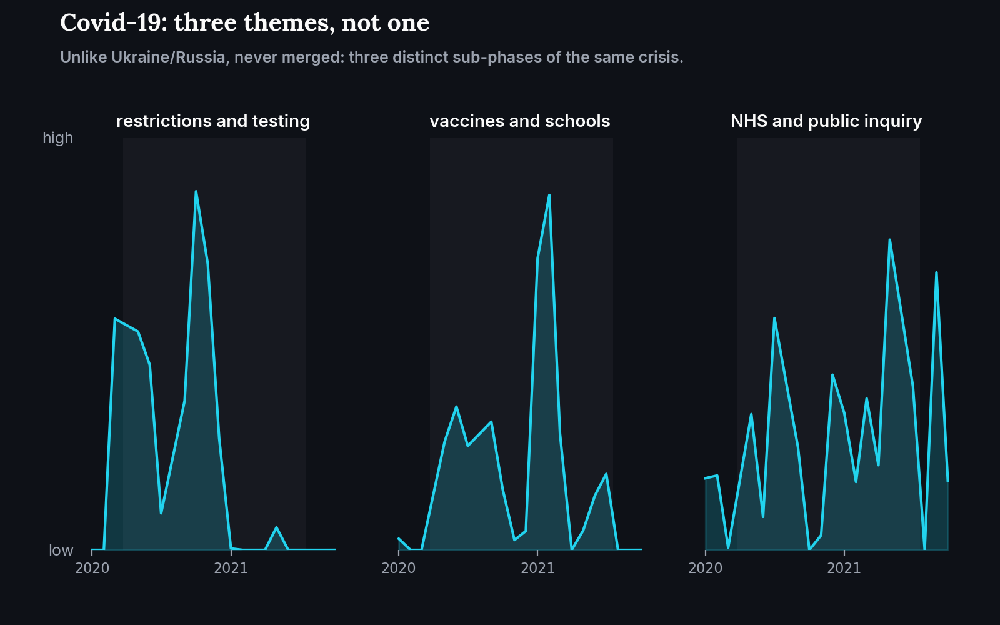

<p align="center">
  
</p>

# The thematic heatmap

[](https://www.python.org/)
[](https://hansard-pm-nlp-nhenez39aujxgtejnyjvrg.streamlit.app)
[](https://github.com/RedaAllab/hansard-pm-nlp)

**7 years of British politics, summarized in a single map, and you can literally watch Brexit, Covid and Ukraine take turns.**

## Contents

- [The message in 3 sentences](#the-message-in-3-sentences)
- [How this visual was built](#how-this-visual-was-built)
- [What it reveals](#what-it-reveals)
- [Secondary visuals](#secondary-visuals)
- [Limitations](#limitations)
- [Reproducing this visual](#reproducing-this-visual)
- [Links](#links)

<p align="center">
  
</p>

## The message in 3 sentences

A UK Prime Minister's parliamentary attention faithfully tracks the shocks of their time. No new model is needed to see it, only a picture of what an already-trained topic model (LDA, Phase 5) had already captured. Each colored band is a topic; the brighter the yellow, the more it dominated debate that month. Across seven years, four sequences stand out without needing an explanation: the post-Brexit Northern Ireland deal in January 2020, Covid-19 over nearly two years, the withdrawal from Kabul in a matter of weeks in summer 2021, then the invasion of Ukraine from February 2022 onward.

## How this visual was built

- **No new model trained**: the document x topic matrix comes as is from `lda_topics.parquet` (Phase 5, [`hansard-pm-nlp`](https://github.com/RedaAllab/hansard-pm-nlp)): 296 documents (PM x sitting), K=14 topics, never restricted to the classifier's 3 PMs (unlike Phase 6), so Liz Truss is included.
- **LDA over BERTopic, by constraint, not by superiority**: [`phase5_topic_comparison_report.md`](https://github.com/RedaAllab/hansard-pm-nlp/blob/main/data/processed/phase5_topic_comparison_report.md) documents that BERTopic, on a corpus of only 296 documents, groups 61% of them into a single catch-all topic. LDA was chosen for this specific corpus size, not because it is intrinsically better; BERTopic is designed for corpora several orders of magnitude larger.
- **The Ukraine/Russia merge (T0+T1) is carried over unchanged**, not redecided: [`phase5_lda_report.md`](https://github.com/RedaAllab/hansard-pm-nlp/blob/main/data/processed/phase5_lda_report.md) documents these two topics as near identical at every K tested, summed into one before any display.
- **The 13 plain language labels are editorial work for this project**, not a reuse: neither the Phase 5 report nor the live dashboard offer any, both only show raw keyword lists or algorithmic labels ("T2: hs, project, rail"). The labels used here (e.g. "Brexit and the Northern Ireland deal") were written from those same keyword lists, with traceability kept in `src/hansard_pm_portfolio/data_access.py`.
- **Crisis windows and tenure dates** come from `PHASE0_SCOPING.md` ([`hansard-pm-extraction`](https://github.com/RedaAllab/hansard-pm-extraction)), never eyeballed on the chart.

## What it reveals

- **The post-Brexit trade deal dominates from the very first month** (January 2020), the sharpest peak on the whole map, before Covid even appears.
- **Covid-19 occupies close to 16 continuous months**, but under 3 distinct angles (restrictions/testing, vaccines/schools, NHS staff/inquiry) that rise and fall at different times, see the zoom below.
- **Afghanistan is the sharpest spike on the map**: nearly invisible before and after, dominant for 2-3 months right at the withdrawal from Kabul (summer 2021).
- **"Budget and domestic policy" becomes the most consistently present topic from late 2022 onward**: under Sunak and then Starmer, attention shifts noticeably from external shock to domestic management.
- **The "Labour leadership crisis" (May-July 2026) is the least recognizable of the 4 crisis windows**: unlike Brexit, Covid or Ukraine, it is a recent event specific to this corpus (the Starmer to Burnham transition), not a global shock the reader already knows.

## Secondary visuals

<table>
<tr>
<td width="60%"></td>
<td width="40%"></td>
</tr>
</table>

The first breaks the 13 topics into small individual panels rather than a single 13 color legend. The live dashboard already tested both formats for its own Topics tab and documented why small multiples win at this scale; reused as is rather than retested. The second zooms in on the 3 Covid topics to show concretely why they were never merged (unlike Ukraine/Russia): they are 3 distinct sub-phases of the same crisis, not a duplicate.

## Limitations

- **Liz Truss (5 documents, 49 days)**: the September to October 2022 columns rest on a very small sample, to be read as a noisy signal, not an established thematic policy.
- **Topic labels are an interpretation, not a model truth**: LDA only produces word distributions; the plain language phrases used here are a human reading of those keywords, not an output of the model itself, another reader of the same keywords could have chosen different wording.
- **The Ukraine/Russia duplicate (T0+T1) is a real signal in the corpus, not an artifact to fix**: documented in `phase5_lda_report.md` as reflecting distinct sub-periods of the conflict (the 2022 invasion, ongoing military aid, NATO summits) with different vocabulary each time, not model instability.
- **LDA on 296 documents remains a modest corpus**: the comparison with BERTopic (see above) shows the choice of method was constrained by corpus size, not validated as optimal in absolute terms.
- **Andy Burnham is out of scope**: he became Prime Minister on 2026-07-20, after this corpus's last sitting at this extraction date, absent from this map by construction, not by after-the-fact filtering.

## Reproducing this visual

From this repo's root:

```bash
jupyter nbconvert --to notebook --execute --inplace notebooks/02_topic_heatmap.ipynb
```

Prerequisite: `hansard-pm-nlp` cloned as a sibling directory (`../hansard-pm-nlp`), see this repo's [root README](../../README.md) for details.

## Links

- [Interactive dashboard](https://hansard-pm-nlp-nhenez39aujxgtejnyjvrg.streamlit.app): the "Topics" tab reproduces this map in a filterable form, with each topic's raw keywords
- [`hansard-pm-nlp`](https://github.com/RedaAllab/hansard-pm-nlp): source repo for the data and model
- [`phase5_lda_report.md`](https://github.com/RedaAllab/hansard-pm-nlp/blob/main/data/processed/phase5_lda_report.md): full technical report of the LDA model
- [`phase5_topic_comparison_report.md`](https://github.com/RedaAllab/hansard-pm-nlp/blob/main/data/processed/phase5_topic_comparison_report.md): LDA vs BERTopic comparison
- [`WRITEUP.md`](https://github.com/RedaAllab/hansard-pm-nlp/blob/main/WRITEUP.md): full write-up of the analysis project
- [Project 04, the recap](../04_annual_recap/README.md): this heatmap's monthly detail condensed into one dominant theme per year, alongside the other 3 projects
