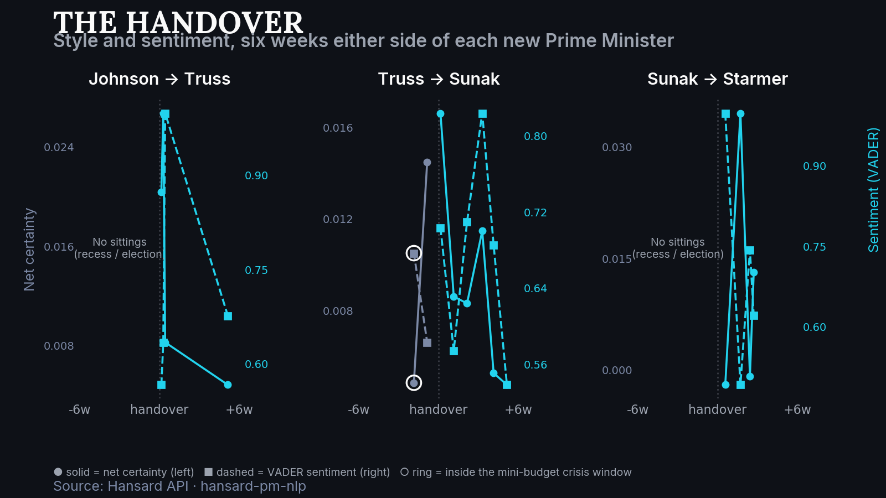
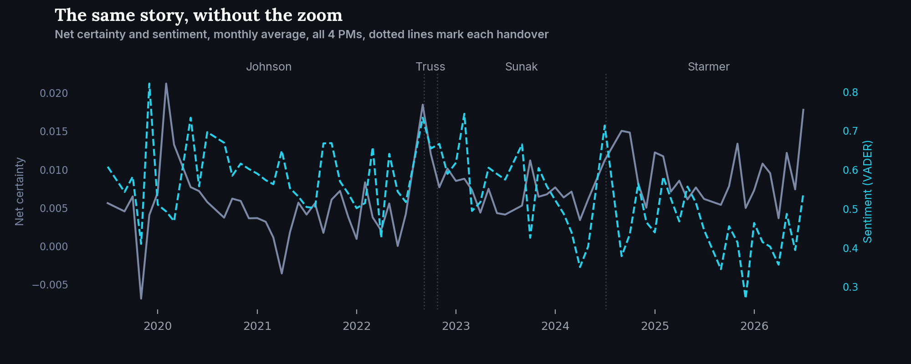

<p align="center">
  
</p>

# The handover

[](https://www.python.org/)
[](https://hansard-pm-nlp-nhenez39aujxgtejnyjvrg.streamlit.app)
[](https://github.com/RedaAllab/hansard-pm-nlp)

**Some Prime Ministers change the tone of Parliament overnight. Others barely move the needle in the six weeks around the handover.**

## Contents

- [The message in 3 sentences](#the-message-in-3-sentences)
- [How this visual was built](#how-this-visual-was-built)
- [What it reveals](#what-it-reveals)
- [Secondary visual](#secondary-visual)
- [Limitations](#limitations)
- [Reproducing this visual](#reproducing-this-visual)
- [Links](#links)

<p align="center">
  
</p>

## The message in 3 sentences

This project isolates the moment of a PM handover from everything else going on in Parliament at the time: net certainty and sentiment, six weeks before and six weeks after each of the 3 transitions in the corpus. It extends an exploratory question already on the table in `hansard-pm-nlp` (H4: does topic attention drift continuously or snap at PM transitions?) to style and sentiment, without repeating the mistake of presenting a picture as a statistical test. This is a descriptive visual, not a re-run of Phase 7's event-study regressions, which is exactly what this project deliberately does not attempt.

## How this visual was built

- **No new model, no new regression**: every value plotted comes from `event_study_dataset.parquet` (Phase 7, [`hansard-pm-nlp`](https://github.com/RedaAllab/hansard-pm-nlp)), 296 sittings across all 4 in-scope PMs, already built there for its own PM x crisis regressions. This project only re-slices that same table around 3 dates.
- **The 3 transitions are derived, not hardcoded**: `data_access.load_pm_transitions()` reads them off `load_pm_tenures()`, so a scope change (adding or removing a PM) propagates automatically instead of leaving a stale row.
- **Net certainty + VADER sentiment, not MTLD**: `ROADMAP_PM_HANDOVER.md`'s own draft suggested MTLD as one of the two "star" metrics. MTLD is a whole-corpus statistic; the segment-based algorithm needs long, continuous text to be stable, and a single sitting is far too short a unit (see `mtld_over_time.parquet`'s own 1,500-word floor per monthly bin, in `hansard-pm-nlp`). Computing it at sitting-date granularity would mean new computation this repo otherwise avoids. `vader_compound` is used instead: already computed per sitting date for all 4 PMs (Truss included), so the substitution costs zero new computation and reads two genuinely different axes, style and sentiment, matching this project's own stated goal, rather than two style metrics. See `ARCHITECTURE.md`.
- **A fixed +/- 6 week window, not stretched to fill a thin side**: `ROADMAP_PM_HANDOVER.md` section 3 is explicit that the axis should never be artificially stretched to hide a small sample. The window stays fixed; where a side is empty, the chart says so in words instead of showing a misleadingly smooth gap.
- **Colors encode before/after, not the value's sign**: grey-blue before, cyan after, deliberately not this project's positive/negative color pair, which is reserved for value judgments this descriptive project does not make.

## What it reveals

- **Johnson to Truss looks like the sharpest shift in the data**, both net certainty and sentiment drop within the first days of her tenure, but this reading needs the caveat below: there is no "before" data to compare it to in the strict 6-week window, so "shift" here really means "a fresh baseline appears", not "a measured change from a known starting point".
- **Truss to Sunak is the one transition with a real before/after comparison on both sides**, and the picture is far less dramatic: values oscillate but do not show one clean before/after gap. The single "before" sitting that overlaps the mini-budget crisis window (ringed on the chart) makes even this comparison partly confounded with the crisis itself, not solely the change of PM.
- **Sunak to Starmer shows a clear sentiment recovery after the transition**, following a general election, the most institutionally "clean" of the 3 handovers on paper, though it too has an empty "before" side (Parliament was dissolved for the campaign).
- **None of this should be read as a confirmed "PM effect"**: Phase 7's own formal event-study regressions (`phase7_event_study_report.md`) tested crisis effects on the same underlying metrics and found no result survives Benjamini-Hochberg correction. This project shows a picture, consistent with that same caution, not a rebuttal of it.

## Secondary visual

<p align="center">
  
</p>

The same two metrics, monthly-averaged across the full corpus, all 4 PMs pooled on one continuous timeline with each handover marked by a dotted line. For a reader who wants to see how the 6-week zooms above sit inside 7 years of context, rather than 3 isolated close-ups.

## Limitations

- **Two of the three "before" windows are empty, for reasons the roadmap did not anticipate**: the roadmap flagged Liz Truss's 49-day tenure as too short to fill a symmetric 6-week window on either side of her two transitions. In practice, the Johnson-to-Truss and Sunak-to-Starmer transitions also have **zero** sittings in the strict 6-week window before the handover, not because of a short tenure, but because Parliament itself was not sitting: summer recess before Johnson resigned, and Parliament's dissolution ahead of the 2024 general election before Starmer took office. This is a genuine gap in when Parliament sat, not a data-coverage problem, and it means only 1 of the 3 transitions (Truss to Sunak) has any real before/after comparison at all in this window definition.
- **The mini-budget crisis window and the Truss to Sunak "before" side overlap on one sitting** (2022-10-12): PM effect and crisis effect are not separable there, flagged on the chart itself, not only here.
- **Liz Truss's 5 sittings are split across both of her transitions**: her whole 49-day tenure is shorter than 2x the 6-week window, so one of her sittings (2022-10-12 again) appears as both the "after" side of Johnson to Truss and the "before" side of Truss to Sunak. Not double counting a modeling target, just what a very short tenure looks like from both ends.
- **Descriptive only, not a re-run of Phase 7's statistical test**: `phase7_event_study_report.md` already tested crisis effects on `net_certainty` and sentiment with PM fixed effects and found no result survives multiple-testing correction. This project's picture should not be read as evidence for or against a PM effect, only as what the raw numbers look like around each handover.
- **Andy Burnham is out of scope**: he became Prime Minister on 2026-07-20, after this corpus's last sitting at this extraction date, so there is no 4th transition to show.

## Reproducing this visual

From this repo's root:

```bash
jupyter nbconvert --to notebook --execute --inplace notebooks/03_pm_handover.ipynb
```

Prerequisite: `hansard-pm-nlp` cloned as a sibling directory (`../hansard-pm-nlp`), see this repo's [root README](../../README.md) for details.

## Links

- [Interactive dashboard](https://hansard-pm-nlp-nhenez39aujxgtejnyjvrg.streamlit.app): the live dashboard this project's underlying table also feeds
- [`hansard-pm-nlp`](https://github.com/RedaAllab/hansard-pm-nlp): source repo for the data
- [`phase7_event_study_report.md`](https://github.com/RedaAllab/hansard-pm-nlp/blob/main/data/processed/phase7_event_study_report.md): the formal event-study regressions this project deliberately does not repeat, and whose null result motivates the caution above
- [`ROADMAP_PM_HANDOVER.md`](../../ROADMAP_PM_HANDOVER.md): execution plan for this project
- [`WRITEUP.md`](https://github.com/RedaAllab/hansard-pm-nlp/blob/main/WRITEUP.md): full write-up of the analysis project
