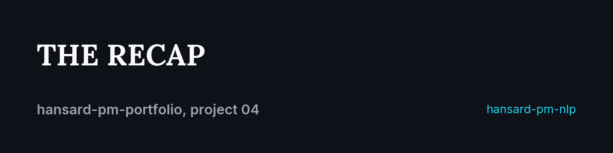
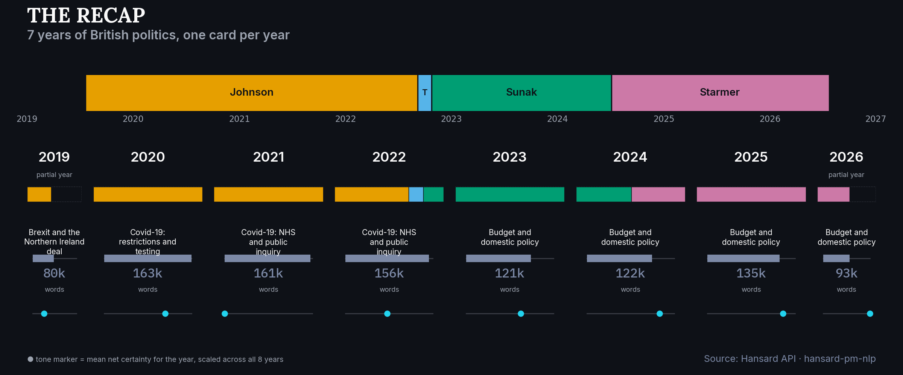

<p align="center">
  
</p>

# The recap

[](https://www.python.org/)
[](https://hansard-pm-nlp-nhenez39aujxgtejnyjvrg.streamlit.app)
[](https://github.com/RedaAllab/hansard-pm-nlp)

**7 years, 4 Prime Ministers, over 10,000 parliamentary contributions, condensed into one image.**

## Contents

- [The message in 3 sentences](#the-message-in-3-sentences)
- [How this visual was built](#how-this-visual-was-built)
- [What it reveals](#what-it-reveals)
- [Limitations](#limitations)
- [Reproducing this visual](#reproducing-this-visual)
- [Links](#links)

<p align="center">
  
</p>

## The message in 3 sentences

This is the portfolio's executive summary: one card per calendar year, each showing who was in office, how much Parliament said, what it mostly talked about, and how certain or hedged that talk was. It is explicitly a **synthesis**, not a replacement for the other three projects: for the month-by-month detail behind any single year's dominant theme, see [project 02](../02_topic_heatmap/README.md); for the style differences between PMs behind any single year's tone marker, see [project 01](../01_style_duel/README.md).

## How this visual was built

- **Built on 2 files, not the roadmap's suggested 4**: `event_study_dataset.parquet` and `lda_topics.parquet` verified to join cleanly (296/296 rows). Detail: [`ANNUAL_RECAP.md`](../../ANNUAL_RECAP.md) §1, [`ARCHITECTURE.md`](../../ARCHITECTURE.md) §19.
- **4 fixed indicators, locked before coding**: PM(s) in office, word volume, dominant theme, tone. Detail: [`ANNUAL_RECAP.md`](../../ANNUAL_RECAP.md) §2.
- **Tone is net certainty again, not a new metric**: this portfolio's recurring throughline (projects 01 and 03 too). Detail: `ANNUAL_RECAP.md` §3.
- **A design document before the rendering code**: this project composes a header frieze plus 8 year-cards rather than one chart type, so the layout was fixed in writing first. See [`ANNUAL_RECAP.md`](../../ANNUAL_RECAP.md).

## What it reveals

- **The dominant theme moves in exactly 3 blocks across 8 years**: Brexit (2019) gives way to Covid-19 (2020-2022, though under 3 distinct sub-themes, see the zoom in project 02), then to "Budget and domestic policy" from 2023 onward, spanning both Sunak's and Starmer's terms. Seen this way, the post-2022 period reads as one long stretch of domestic focus, not four separate years.
- **Word volume is not flat**: 2020 and 2021 (163k and 161k words) are the two densest years, both under Johnson during Covid; 2019 and 2026 are the two lowest, both partial years, not necessarily quieter ones.
- **2022 is the only year with 3 PMs in one card**: Johnson, Truss (a sliver too narrow to read without the "T" label) and Sunak, visibly compressed into a single 12-month column, exactly the simplification project 03 examines in detail for that same period.
- **The tone marker moves independently of the dominant theme**: 2021 (Covid, NHS/inquiry) has this corpus's lowest net certainty, while 2026 (domestic budget policy) has its highest, a reminder that "what was talked about" and "how certain it was said" are two different axes, not one.

## Limitations

- **"Dominant theme" is a simplification by construction**: a year can have 2-3 themes close in weight; the argmax hides that nuance. See [project 02](../02_topic_heatmap/README.md)'s heatmap for the month-by-month detail this card collapses into one label.
- **Transition years compress 2-3 tenures into one card**: the segmented PM band limits this (the reader can see Truss's sliver, not just Johnson's or Sunak's name), but does not eliminate the simplification. See [project 03](../03_pm_handover/README.md) for those transitions examined directly.
- **2019 and 2026 are both partial years**, for different reasons: 2019 because the corpus starts in July (Johnson's tenure), 2026 because the corpus extraction cuts off in July, not because Starmer's tenure ended. Both are captioned "partial year" and rendered as a visibly narrower card, not silently averaged as if they were full 12-month years. The second of these two was found while building this project, not anticipated in `ROADMAP_ANNUAL_RECAP.md`'s own text.
- **This synthesis smooths over month-level dynamics already visible in project 02 by construction**: a year-level average cannot show a spike that rises and falls within a single year (Afghanistan, summer 2021, is invisible at this resolution). Complementary to the monthly heatmap, not a more precise version of it.
- **Andy Burnham is out of scope**: he became Prime Minister on 2026-07-20, after this corpus's last sitting at this extraction date, so there is no partial 9th card for him.

## Reproducing this visual

From this repo's root:

```bash
jupyter nbconvert --to notebook --execute --inplace notebooks/04_annual_recap.ipynb
```

Prerequisite: `hansard-pm-nlp` cloned as a sibling directory (`../hansard-pm-nlp`), see this repo's [root README](../../README.md) for details.

## Links

- [Interactive dashboard](https://hansard-pm-nlp-nhenez39aujxgtejnyjvrg.streamlit.app): the live, filterable version of the data this static recap summarizes
- [`hansard-pm-nlp`](https://github.com/RedaAllab/hansard-pm-nlp): source repo for the data
- [`ROADMAP_ANNUAL_RECAP.md`](../../ROADMAP_ANNUAL_RECAP.md): execution plan for this project
- [`ANNUAL_RECAP.md`](../../ANNUAL_RECAP.md): layout decisions, written before the rendering code
- [Project 01, the style duel](../01_style_duel/README.md): the style detail behind this card's tone marker
- [Project 02, the thematic heatmap](../02_topic_heatmap/README.md): the monthly detail behind this card's dominant theme
- [Project 03, the handover](../03_pm_handover/README.md): the 2022 and 2024 transitions examined directly
- [`WRITEUP.md`](https://github.com/RedaAllab/hansard-pm-nlp/blob/main/WRITEUP.md): full write-up of the analysis project
